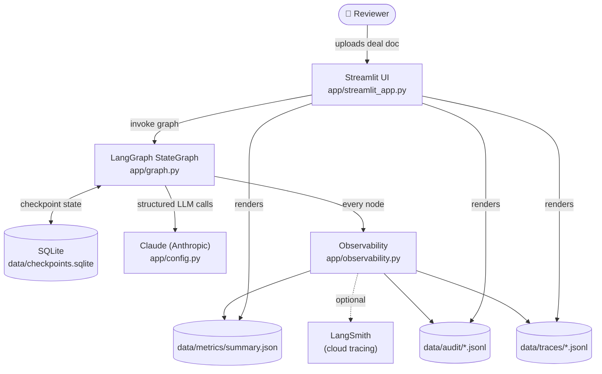
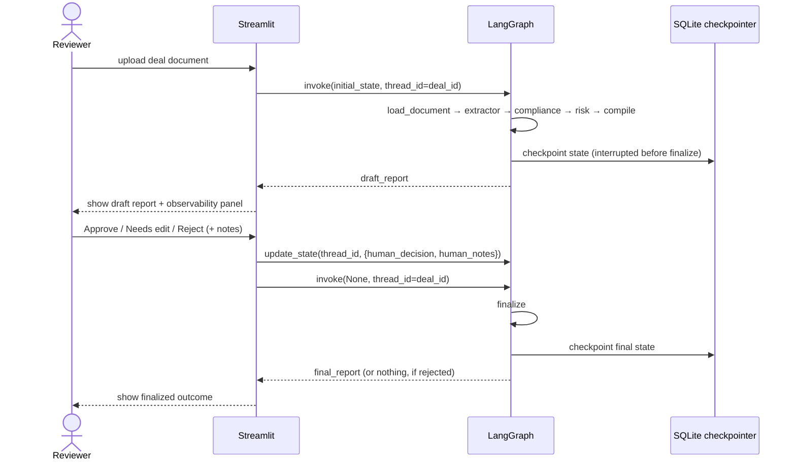
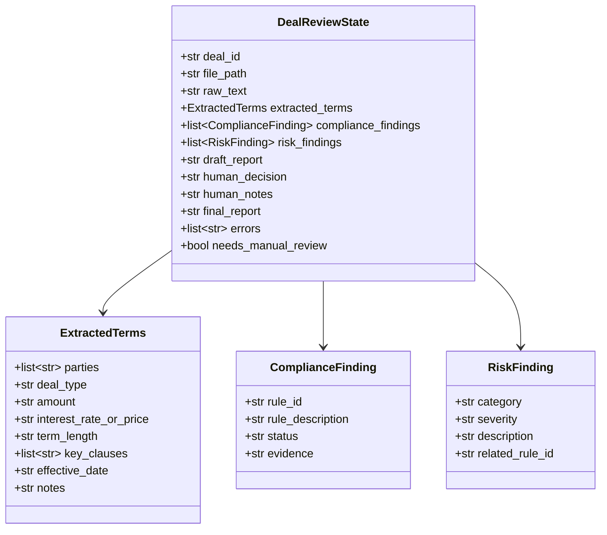

# Architecture — Multi-Agent Deal Review Pipeline

See [FRAMEWORK.md](../FRAMEWORK.md) for the one-liner and agent framework this
build follows. This doc covers *how* it's built: the graph, the state, the
human-in-the-loop interrupt, and failure handling.

## System overview

## Pipeline graph

```mermaid
flowchart LR
    Start(["start"]) --> Load["load_document\n(parse PDF/DOCX/TXT)"]
    Load -->|parsed ok| Extract["extractor_agent\n(LLM, structured output)"]
    Load -->|parse failed| Compile
    Extract --> Compliance["compliance_agent\n(LLM, checks rules.yaml)"]
    Compliance --> Risk["risk_agent\n(LLM, severity + narrative)"]
    Risk --> Compile["orchestrator_compile\n(deterministic merge, no LLM)"]
    Compile -->|interrupt_before| Human{{"⏸ human_review\nStreamlit approve / edit / reject"}}
    Human -->|resume| Finalize["finalize\n(writes final_report if approved)"]
    Finalize --> End(["end"])

    style Human fill:#f9d976,stroke:#333,stroke-width:2px
```

Each box is a LangGraph node operating on one shared `DealReviewState` object
(`app/state.py`). The graph is compiled with `interrupt_before=["finalize"]`,
so it always pauses for a human decision before anything is written as final
— this is the one hard requirement from the framework's human-in-the-loop
field.

## Human-in-the-loop sequence

Because state is checkpointed to SQLite per `thread_id` (= `deal_id`), a
review that's abandoned mid-way — browser closed, app restarted — is not
lost. Re-running `graph.invoke(None, config)` with the same `thread_id`
resumes exactly where it left off.

## State schema

`DealReviewState` (`app/state.py`) is the single object threaded through
every node — nothing is passed around out-of-band.

## Agent responsibilities

| Node | Type | Reads | Writes | LLM call? |
|---|---|---|---|---|
| `load_document` | tool | `file_path` | `raw_text`, `errors` | no |
| `extractor_agent` | agent | `raw_text` | `extracted_terms`, `errors` | yes — structured output |
| `compliance_agent` | agent | `extracted_terms`, `rules.yaml` | `compliance_findings`, `errors` | yes — structured output |
| `risk_agent` | agent | `extracted_terms`, `compliance_findings` | `risk_findings`, `errors` | yes — structured output |
| `orchestrator_compile` | orchestrator | entire state | `draft_report` | **no** — deterministic merge |
| `finalize` | tool | `human_decision`, `draft_report` | `final_report` | no |

The orchestrator is deliberately not an LLM call: it merges exactly what the
upstream agents produced, so it can never introduce a finding the agents
didn't. See [FRAMEWORK.md](../FRAMEWORK.md) → "What should it never do?"

## Failure handling

| Failure | Where it's caught | Behavior |
|---|---|---|
| Bad/empty file, unsupported type | `load_document` | Hard stop, no LLM calls spent, routed straight to `orchestrator_compile` to explain the failure. |
| Malformed/empty structured LLM output | `app/agents/_llm_utils.py` | One retry with a repair prompt; on 2nd failure, node returns `None` and sets `needs_manual_review=True` rather than crashing the run. |
| Rule can't be evaluated from available terms | `compliance_agent` (LLM instructed) | Returns `status="unclear"`, never silently `"pass"`. Since Week 4's evaluation (see below), this is scoped more precisely: `"unclear"` is for a rule that *plausibly applies* but can't be confirmed (e.g. a rate referenced but deferred to an unattached exhibit); a rule that *doesn't apply to this deal type at all* (e.g. a rate cap on a document with no rate/price dimension whatsoever) now returns a reasoned `"pass"` instead — see `data/compliance/rules.yaml` R1 and `COMPLIANCE_SYSTEM_PROMPT` rules 1a/1b. |
| Downstream node has no upstream terms to work with | `compliance_agent`, `risk_agent` | Skips itself, appends to `errors`, sets `needs_manual_review=True`, pipeline still completes. |
| Human hasn't submitted a decision yet | `finalize` (via `interrupt_before`) | Graph stays paused; nothing is finalized until an explicit `approved`/`rejected`/`needs_edit` is recorded. |

This is what's meant by "falls over gracefully" — every failure mode ends in
a reviewable report with `needs_manual_review=True` and a logged reason, not
a stack trace.

## Observability

Three separate outputs, kept separate on purpose (see
`app/observability.py`):

- **Trace** (`data/traces/<deal_id>.jsonl`) — every node's start/end/error/
  duration/retries. Debug-grade, verbose.
- **Audit** (`data/audit/<deal_id>.jsonl`) — only decision-relevant events:
  document loaded, review finalized, who approved/rejected and when. What
  you'd actually show an auditor.
- **Metrics** (`data/metrics/summary.json`) — rolling avg duration + error
  count per node, across all runs. Shown live in the Streamlit sidebar.
- **LangSmith** (optional) — set `LANGCHAIN_TRACING_V2=true` +
  `LANGCHAIN_API_KEY` in `.env` for full cloud tracing on top of the above;
  everything else works with zero external accounts.

The Streamlit UI renders a per-stage observability panel after every run
(and again after the human-review resume): one row per pipeline stage with
status, duration, retry count, and any error — plus the full audit trail —
so nothing about a given run is a black box.

## Systematic evaluation (Week 4)

This architecture didn't change structurally for Week 4 — no new nodes, no new
state fields — but the compliance rule/prompt text did, found via a 34-case golden
dataset evaluation run against this exact graph. See the sibling
`Week 4 Project/docs/EVAL_ARCHITECTURE.md` for how that evaluation itself is built
(dataset construction, LangSmith instrumentation, the baseline → fix → re-run
loop), and this repo's `CHANGELOG.md` for what specifically changed here as a
result.
